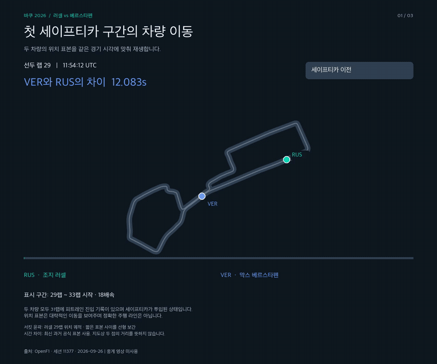

# 바쿠 2026: 러셀–베르스타펜 경기 맥락 분석

[English](README.md) · [한국어](README.ko.md)

**현재 상태: V3의 경기 흐름·후보 랩 비교까지 재현 가능. 재출발 경계와 충돌 공지 검토가 남아 있어 페이스 결과는 잠정값입니다.**

## 분석 질문

2026년 9월 26일 아제르바이잔 GP에서 러셀이 베르스타펜을 0.196초 차이로 앞섰습니다. 세이프티카와 피트 활동 전후에 공식 시간 차이는 어떻게 변했고, 두 선수의 랩타임은 어떻게 공정하게 비교해야 할까요?

러셀(63번)과 베르스타펜(3번)을 주 분석 대상으로 삼고 최종 Top 10은 경기 맥락으로 사용합니다. 원본에는 22명 전체를 보존합니다. 최종 완주자를 먼저 고르는 방식은 리타이어·신뢰성 분석에 적합하지 않습니다.

## 데이터와 검증

- [OpenF1](https://openf1.org/docs/) 세션 **11377**, 대회 **1295**. API 응답 원본 바이트를 `data/raw`에 보존합니다.
- 날짜·우승자·최종 격차 0.196초는 [F1 공식 결과](https://www.formula1.com/en/racing/2026/azerbaijan)와 대조했습니다.
- 드라이버 조인 전후 983개 랩. 중복 랩 키와 드라이버 미매칭 모두 0개입니다.
- 두 선수 102개 랩의 랩타임 결측은 0개이며, 최종 Top 10은 510개 랩입니다.
- 전체 데이터의 랩타임 결측 7개와 타이어 구간 미매칭 7개는 그대로 남깁니다. 0으로 채우지 않습니다.
- 운영 공지는 총 141개, 세션 시작~종료 구간에는 88개입니다. 해당 구간의 SC 투입 공지 2개, RED 깃발 행 0개입니다.
- 영상용 위치는 드라이버마다 2,115개 표본이며, 시간 중복과 최대 표본 간격을 영상 생성 때 검사합니다.
- 저장된 자료에 출발 그리드가 없습니다. 최초 순위 표본으로 대신 추정하지 않습니다.

[검증 결과](data/processed/data_audit.json), 시각별 원본 목록, [데이터 사전](docs/data_dictionary.ko.md)을 참고하세요. 파일 수정 시각은 최초 다운로드 시각이 아닙니다. 확인되지 않은 수집 시각은 null로 남깁니다.

## 방법과 현재 확인한 내용

1. `gap_to_leader`라는 공식 시간 차이를 사용합니다. 러셀이 계속 선두인지 순위 기록을 먼저 확인합니다.
2. SC 투입과 피트 활동을 함께 표시합니다. 음영 끝은 재출발 경계 후보이며 실제 철수 시각 확정값이 아닙니다.
3. 같은 랩 번호끼리 `차이 = 베르스타펜 랩타임 − 러셀 랩타임`을 구하고, 그 차이들의 중앙값을 계산합니다.
4. 두 선수의 위치를 같은 UTC 시각에 맞춥니다. 짧은 표본 간격을 선형 보간하지만 정밀 주행 라인이나 시간 차이를 좌표로 계산하지 않습니다.

탐색용 고정 창 21–30랩과 41–50랩에서 공지 랩을 제외하면 각각 9개 랩 쌍이 남습니다. 동일 랩 차이 중앙값은 **+0.316초/랩**, **+0.012초/랩**입니다. 전체 깃발 시간 구간과 랩의 겹침을 아직 검토하지 않았으므로 최종 정상 주행 페이스 추정값이 아닙니다.

SC와 피트 활동이 겹친 구간에서 시간 차이가 줄었습니다. 이를 타이어 교체의 독립적인 효과나 가상의 우승자에 대한 증거로 해석할 수 없습니다.

## 영어·한국어와 파일 형식

두 언어는 같은 `data/`와 지표 정의를 사용합니다. V1·V2는 작업 단계이며 서로 다른 통계 모델 버전이 아닙니다.

| 단계 | 영어 Python | 한국어 Python | 영어 노트북 | 한국어 노트북 |
|---|---|---|---|---|
| V1 자료 준비·검증 | [스크립트](scripts/en/v1_prepare_data.py) | [스크립트](scripts/ko/v1_prepare_data.py) | [노트북](notebooks/en/v1_prepare_data.ipynb) | [노트북](notebooks/ko/v1_prepare_data.ipynb) |
| V2 탐색 차트·이동 영상 | [스크립트](scripts/en/v2_build_visuals.py) | [스크립트](scripts/ko/v2_build_visuals.py) | [노트북](notebooks/en/v2_build_visuals.ipynb) | [노트북](notebooks/ko/v2_build_visuals.ipynb) |
| V3 경기 흐름·후보 동일 랩 페이스 | [스크립트](scripts/en/v3_race_context_and_pace.py) | [스크립트](scripts/ko/v3_race_context_and_pace.py) | [노트북](notebooks/en/v3_race_context_and_pace.ipynb) | [노트북](notebooks/ko/v3_race_context_and_pace.ipynb) |

노트북에는 주석이 달린 실제 구현 코드와 단계별 설명을 넣었습니다. 스크립트를 실행하는 한 줄만 넣은 노트북이 아닙니다. 반복 실행은 `.py`, 단계별 학습과 중간 결과 확인은 `.ipynb`로 하시면 됩니다.

## 실행 방법

Python 3.10 이상에서 이 프로젝트 폴더를 기준으로 실행합니다.

```bash
python -m venv .venv
source .venv/bin/activate
python -m pip install -r requirements.txt
python scripts/ko/v1_prepare_data.py
python scripts/ko/v2_build_visuals.py
python scripts/ko/v3_race_context_and_pace.py
# 영어 버전
python scripts/en/v1_prepare_data.py
python scripts/en/v2_build_visuals.py
python scripts/en/v3_race_context_and_pace.py
```

Windows에서는 `.venv\Scripts\activate`로 가상환경을 켭니다. 한글 시각화에는 AppleGothic, 맑은 고딕, 나눔고딕, Noto Sans CJK 같은 한글 글꼴이 필요합니다. Linux에서는 배포판의 Noto CJK 글꼴 패키지를 설치하세요.

V1은 기본적으로 저장된 원본을 읽습니다. 부족한 원본을 새로 받으려면 `--fetch-missing`을 붙이며 기존 원본은 보존합니다. 출발 그리드 API는 사용 불가일 수 있습니다. 요청은 충분한 간격을 두고 순차 실행합니다. 저장된 과거 자료를 재현하는 데 토큰은 필요하지 않습니다.

노트북은 `jupyter lab`에서 설치한 환경의 Python 커널을 선택하고 원하는 언어 폴더 파일을 열어 **Run All**로 실행합니다. V1 다음 V2 순서입니다. V3는 저장된 원본을 직접 읽어 독립 실행할 수 있습니다. `imageio-ffmpeg`가 FFmpeg를 제공하므로 시스템에 따로 설치하지 않아도 됩니다.

## 결과 파일

| 결과 | 영어 | 한국어 |
|---|---|---|
| 반복 재생 이동 영상 | [GIF](outputs/en/01_track_replay.gif) · [MP4](outputs/en/01_track_replay.mp4) | [GIF](outputs/ko/01_track_replay.gif) · [MP4](outputs/ko/01_track_replay.mp4) |
| 공식 시간 차이 | [PNG](outputs/en/02_gap_timeline.png) | [PNG](outputs/ko/02_gap_timeline.png) |
| 탐색용 페이스·타이어 | [PNG](outputs/en/03_paired_pace_and_tyres.png) | [PNG](outputs/ko/03_paired_pace_and_tyres.png) |
| 로컬 미리보기 | [HTML](outputs/en/preview.html) | [HTML](outputs/ko/preview.html) |

GitHub README에서는 GIF가 바로 재생됩니다. HTML은 GitHub에서 소스로 표시됩니다. 로컬 미리보기는 프로젝트 폴더에서 `python -m http.server 8765`를 실행하고 `http://127.0.0.1:8765/outputs/ko/preview.html` 또는 영어 `en` 주소로 여세요.



## 활용·한계·다음 단계

LinkedIn에서는 **경기 맥락 → 공식 시간 차이 → 조건에 맞는 동일 랩 페이스** 순서로 설명하고 최종 Top 10은 배경으로 사용하세요. 최종 페이스 결론을 게시하기 전에 [분석 설계](docs/analysis_plan.ko.md)에 따라 재출발 시각을 검토하고, 두 선수의 랩에 SC/VSC/RED·황색기 시간 구간 필터를 적용한 뒤 민감도·표본 수·산포를 보고해야 합니다.

연료 보정, 통제된 타이어 마모 추정, 교통 방해의 직접 증명, 전략의 인과 효과, 시즌 전체 일반화는 하지 않았습니다. 피트레인 통과 기록만으로 타이어 교체를 확정하지 않습니다. 현재 세 결과물은 탐색 과정을 보여줍니다.

기존 과거 F1 프로젝트는 [유지·수정 검토](docs/existing_f1_review.ko.md)에 별도로 정리했습니다. 원본 코드는 유지하며, 이번 작업에서 과거 모델을 다시 학습하거나 성능을 재검증하지 않았습니다.

## V3: 경기 질문부터 따라가기

새 [V3 따라가기 안내](docs/v3_walkthrough.ko.md)는 경기 흐름 → 후보 랩 선정 → 동일 랩 페이스 → 타이어 맥락 순서입니다. 저장된 원본을 직접 읽으므로 V3 실행 전에 V1·V2를 실행할 필요는 없습니다. `python scripts/ko/v3_race_context_and_pace.py` 또는 영어 스크립트를 실행하거나 해당 노트북에서 Run All을 선택하세요.

공통 계산 표는 `data/processed/v3`, 언어별 차트·설명은 `outputs/en/v3`와 `outputs/ko/v3`에 저장합니다. 보수적인 황색기 시간 제외를 적용한 현재 후보는 SC 전 27개 쌍(VER−RUS 중앙값 **+0.266초**), 후반 9개 쌍(**+0.012초**)입니다. V2의 고정 창보다 전반 비교 범위가 넓어져 값이 다릅니다. V2는 보존했습니다.

새 계산으로 **최종 비교 랩 검토가 완료된 것은 아닙니다.** SC 끝은 후보이고, 같은 시각 YELLOW/CLEAR 공지 두 묶음과 종료 전 CLEAR가 없는 황색기 구간 두 개를 검토 표에 남겼습니다. V3는 잠정 비교와 검증 기록이며 확정 정상 주행 페이스나 인과 분석이 아닙니다. 경계 ±1초 검사가 모든 재출발 경계의 정확성을 보장하지는 않습니다. [실행 기록](docs/v3_execution_check.json)을 확인하세요.

## V4: 전체 경기 위치 재생

전체 51랩, 경기 시간 98분 02.755초를 영상 4분 05.2초에 담았습니다. 대략적인 위치 재생입니다. 시간 차이는 공식 표본이며 SC 철수 시각은 경계 후보입니다.

`requirements.txt` 설치 후 `python scripts/ko/v4_full_race_replay.py`를 실행하세요. 기본은 저장된 원본을 읽으며 부족한 자료만 받으려면 `--fetch-missing`을 붙입니다. 영어 스크립트도 같은 방식입니다. 노트북은 기본적으로 대표 프레임 3개를 그립니다. `RENDER_FULL_VIDEO=True`이면 전체 영상을 인코딩합니다. 

| 언어 | Python | 노트북 | 전체 MP4 | 플레이어 |
|---|---|---|---|---|
| English | [Python](scripts/en/v4_full_race_replay.py) | [Notebook](notebooks/en/v4_full_race_replay.ipynb) | [MP4](outputs/en/v4/01_full_race_replay.mp4) | [HTML](outputs/en/v4/replay.html) |
| 한국어 | [Python](scripts/ko/v4_full_race_replay.py) | [Notebook](notebooks/ko/v4_full_race_replay.ipynb) | [MP4](outputs/ko/v4/01_full_race_replay.mp4) | [HTML](outputs/ko/v4/replay.html) |

전체 세션 원본 응답은 `.json.gz`로 무손실 압축했고 바탕화면에는 JSON 원본도 남겼습니다. 경기 시간 범위 제외와 해시 기록은 [replay_audit.json](data/processed/v4/replay_audit.json). 긴 표본 공백에서는 점을 숨기고 오래된 시간 차이는 비웁니다. 스틴트 시작 사용량은 현재 타이어 사용량이 아닙니다. SC 종료 후보는 잠정적입니다. 기존 V1–V3와 짧은 V2 영상은 보존했습니다. 

플레이어는 프로젝트에서 `python src/serve_replays.py --port 8767`을 실행한 뒤 `http://127.0.0.1:8767/outputs/ko/v4/replay.html`로 여세요. GitHub에서는 프로젝트를 내려받아 사용하세요. HTML은 소스로 표시됩니다.

[전체 영상 설명서](docs/v4_replay_guide.ko.md) · [실행 확인](docs/v4_execution_check.json)
