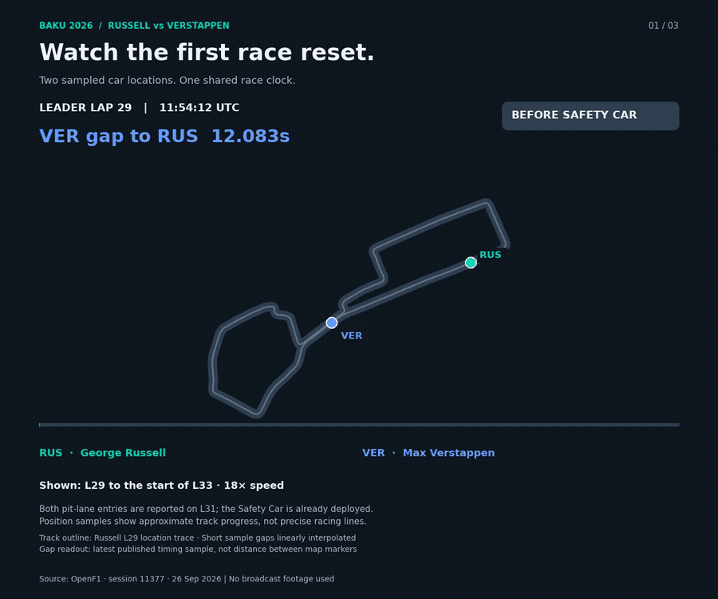

# Baku 2026: Russell–Verstappen Race Context

[English](README.md) · [한국어](README.ko.md)

**Status: V3 race context and candidate paired-lap comparisons are reproducible. Restart boundaries and conflicting race-control messages still need review; pace results remain provisional.**

## Problem

Russell finished 0.196 seconds ahead of Verstappen at the 26 September 2026 Azerbaijan GP. How did their published timing gap evolve around Safety Car deployments and pit activity, and how should their lap times be compared fairly?

The main comparison is Russell (63) versus Verstappen (3). The final Top 10 provides race context; all 22 drivers remain in the raw data. Selecting final finishers is not suitable for reliability analysis.

## Data and validation

- [OpenF1](https://openf1.org/docs/), session **11377**, meeting **1295**; original response bytes are retained in `data/raw`.
- [Official F1 race result](https://www.formula1.com/en/racing/2026/azerbaijan) supports the date, winner, and 0.196-second finish margin.
- 983 driver-lap rows before and after the driver join; zero duplicate lap keys and zero unmatched driver names.
- Main pair: 102 rows, no missing lap durations. Final Top 10: 510 rows.
- Full field: seven missing lap durations and seven unmatched stint rows are retained, not replaced with zeros.
- Race control: 141 total notices, 88 within the session-start/finish interval; two SC deployments and zero RED-flag rows within that interval.
- Replay: 2,115 location samples per driver; duplicate timestamps and maximum sample gaps are checked during rendering.
- Starting-grid data is absent from this snapshot. A first position sample is never substituted for a grid result.

See [data audit](data/processed/data_audit.json), timestamped source manifests, and [data dictionary](docs/data_dictionary.md). An existing file's modification time is not its original retrieval time; unknown retrieval timestamps remain null.

## Method and current findings

1. Plot the published `gap_to_leader`; Russell's position feed is checked before interpreting this as the gap to Russell.
2. Show Safety Car deployments alongside pit activity. SC shading uses provisional restart boundaries, not verified withdrawal times.
3. Compare same-numbered laps: `delta = Verstappen lap time − Russell lap time`; then calculate the median of the paired differences.
4. Render location samples onto one UTC clock, with short gaps linearly interpolated. Coordinates do not measure precise racing lines or timing gaps.

The exploratory fixed-window comparison retains nine paired laps in L21–30 and nine in L41–50 after a notice-lap filter. Median differences are **+0.316 s/lap** and **+0.012 s/lap**, respectively. These are exploratory summaries, not final clean-lap estimates. Full temporal flag-overlap review remains necessary.

The timing gap compressed during a period containing both race neutralisation and pit activity. This does not isolate a tyre-change effect or establish a counterfactual winner.

## English and Korean versions

Both languages share `data/` and the same metric definitions. V1 and V2 identify workflow stages, not alternative statistical models.

| Stage | English Python | Korean Python | English notebook | Korean notebook |
|---|---|---|---|---|
| V1 — prepare and audit | [script](scripts/en/v1_prepare_data.py) | [스크립트](scripts/ko/v1_prepare_data.py) | [notebook](notebooks/en/v1_prepare_data.ipynb) | [노트북](notebooks/ko/v1_prepare_data.ipynb) |
| V2 — exploratory visuals and replay | [script](scripts/en/v2_build_visuals.py) | [스크립트](scripts/ko/v2_build_visuals.py) | [notebook](notebooks/en/v2_build_visuals.ipynb) | [노트북](notebooks/ko/v2_build_visuals.ipynb) |
| V3 — race context and candidate paired pace | [script](scripts/en/v3_race_context_and_pace.py) | [스크립트](scripts/ko/v3_race_context_and_pace.py) | [notebook](notebooks/en/v3_race_context_and_pace.ipynb) | [노트북](notebooks/ko/v3_race_context_and_pace.ipynb) |

The notebooks contain the actual commented code, with sections explaining its purpose. They do not hide the implementation behind a script runner. Scripts are for repeatable execution; notebooks are for reading each stage and inspecting intermediate results.

## Run

Use Python 3.10+ and run from this project directory:

```bash
python -m venv .venv
source .venv/bin/activate
python -m pip install -r requirements.txt
python scripts/en/v1_prepare_data.py
python scripts/en/v2_build_visuals.py
python scripts/en/v3_race_context_and_pace.py
# Korean equivalents
python scripts/ko/v1_prepare_data.py
python scripts/ko/v2_build_visuals.py
python scripts/ko/v3_race_context_and_pace.py
```

On Windows, activate with `.venv\Scripts\activate`. Korean rendering requires a Korean font, such as AppleGothic, Malgun Gothic, NanumGothic, or Noto Sans CJK. On Linux, install your distribution's Noto CJK font package before rendering Korean graphics.

V1 uses saved snapshots by default. To download missing core and replay inputs, add `--fetch-missing`; existing raw files are preserved. The optional grid endpoint may be unavailable. Downloads use conservative spacing. No token is included or required for the saved historical-data workflow.

For notebooks, run `jupyter lab`, select the environment's Python kernel, open the desired `notebooks/en` or `notebooks/ko` file, and **Run All**. Run V1 before V2. FFmpeg is provided by `imageio-ffmpeg`; an additional system installation is unnecessary.

## Outputs

| Output | English | Korean |
|---|---|---|
| Looping track replay | [GIF](outputs/en/01_track_replay.gif) · [MP4](outputs/en/01_track_replay.mp4) | [GIF](outputs/ko/01_track_replay.gif) · [MP4](outputs/ko/01_track_replay.mp4) |
| Published gap timeline | [PNG](outputs/en/02_gap_timeline.png) | [PNG](outputs/ko/02_gap_timeline.png) |
| Exploratory paired pace and tyres | [PNG](outputs/en/03_paired_pace_and_tyres.png) | [PNG](outputs/ko/03_paired_pace_and_tyres.png) |
| Local preview | [HTML](outputs/en/preview.html) | [HTML](outputs/ko/preview.html) |

GitHub displays this GIF directly; HTML is source code on GitHub. For the interactive local preview, run `python -m http.server 8765` from the project directory and open `http://127.0.0.1:8765/outputs/en/preview.html` or its `ko` equivalent.



## Implication, limitation, and next step

For a LinkedIn case study, build the story around **race context → published gap → eligible paired pace**, using the final Top 10 as context. Complete [the analysis design](docs/analysis_plan.md) before publishing a final pace conclusion: verify restarts, apply SC/VSC/RED and yellow-flag time-overlap exclusions to both drivers, and report sensitivity checks, pair counts, and spread.

There is no fuel correction, controlled tyre-degradation estimate, proof of traffic obstruction, causal strategy effect, or season-level generalisation. A pit-lane passage alone is not a tyre change. The three visuals currently illustrate an exploratory workflow.

Existing historical F1 projects are reviewed separately in [the keep/change assessment](docs/existing_f1_review.md). They are preserved; this project does not retrain their models or validate their reported accuracy.

## V3: start with the race question

The new [V3 walkthrough](docs/v3_walkthrough.md) follows race flow → candidate lap selection → paired pace → tyre context. It reads saved raw inputs directly; running V1/V2 first is optional for V3. Run `python scripts/en/v3_race_context_and_pace.py`, or its Korean equivalent, or Run All in the matching notebook.

V3 saves shared tables in `data/processed/v3` and language-specific figures/notes in `outputs/en/v3` and `outputs/ko/v3`. With conservative temporal yellow exclusions, the current candidate samples contain 27 pre-SC pairs (median VER−RUS **+0.266 s**) and nine later pairs (**+0.012 s**). These differ from V2's earlier fixed-window summary because the pre-SC window is broader; V2 is preserved.

The new computation **does not close the final eligibility gate**. SC ends remain candidates, two simultaneous YELLOW/CLEAR groups and two yellow intervals without a clear before session end are recorded for review. V3 produces provisional comparisons and audit trails, not finalized clean-lap or causal claims. Boundary ±1-second checks do not establish the correctness of every possible restart boundary. See [execution evidence](docs/v3_execution_check.json).
