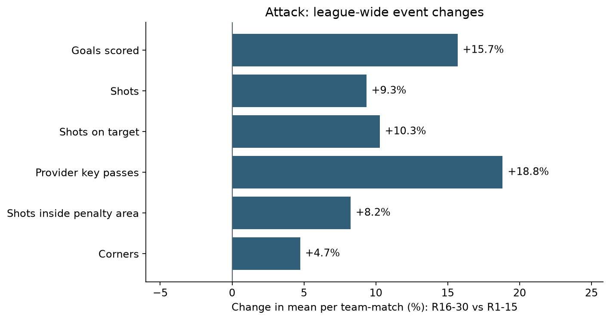

# K League 1 2026: Before and After the World Cup Break

**What changed in league-wide match statistics and club results after the break?**

This project compares rounds 1–15 with rounds 16–30, first across the league and then through three case studies: FC Anyang, Daejeon Hana Citizen and Jeju SK.

It is a descriptive analysis of observed changes, **not a prediction model or an estimate of the causal effect of the break**. The three clubs were selected after observing changes in their league positions.

## Findings at a glance

- League goals per team per match rose by 15.7% and shots by 9.3%, while pass attempts fell by 3.6%.
- **Anyang:** goals conceded increased from 16 to 31. Excluding the 0–7 loss to Seoul still leaves an increase of about 0.65 goals conceded per match, comparing 14 post-break matches with 15 pre-break matches.
- **Daejeon:** goals scored increased from 17 to 29; matches without scoring fell from seven to two.
- **Jeju:** defeats fell from seven to one, despite fewer shots on target per match and more shots on target faced. Shot counts alone do not explain the improvement in results.



The practical output is a narrower set of questions for match review: where Anyang allowed shots on target, which Daejeon matches combined high shot counts with multiple goals conceded, and which match situations accompanied Jeju's fewer defeats.

## Four learning stages

The `v1`–`v4` labels are **learning stages of one analysis**, not four competing models or a fabricated development history. Each stage has an English Python script and an executed Jupyter notebook containing the same code.

| Stage | Question | Notebook | Main output |
|---|---|---|---|
| v1 — Data preparation | Are the inputs complete and correctly joined? | [Prepare data](notebooks/v1_prepare_data.ipynb) | Validated team-match dataset |
| v2 — League overview | How did attack, defense, passing and standings differ? | [League overview](notebooks/v2_league_overview.ipynb) | 43-metric dictionary, league/team comparisons, standings, charts |
| v3 — Club comparisons | How do Anyang, Daejeon and Jeju differ? | [Focus teams](notebooks/v3_focus_teams.ipynb) | W/D/L accounting, scoreless matches, review groups, club charts |
| v4 — Sensitivity | Do the interpretations depend on one match or schedule composition? | [Robustness](notebooks/v4_robustness.ipynb) | PPG reweightings, match distributions, omission ranges |

Read the notebooks in order. The source code lives in [`scripts/`](scripts/), with shared paths and plotting settings in [`project_config.py`](project_config.py).

## Scope and definitions

| Item | Definition |
|---|---|
| Competition | K League 1, 2026 |
| Baseline | Rounds 1–15 |
| Comparison | Rounds 16–30 |
| Coverage | 180 fixtures; 360 team-match observations; 12 clubs |
| Club denominator | 15 matches per club in each period |
| PPG | Points divided by matches played |
| Count metrics | Period total divided by the actual number of team-match observations |
| Rates | Pooled numerator divided by pooled denominator, not mean match percentages |
| Percentage-point change | Difference between two percentages; distinct from relative percentage change |
| Standings | Cumulative R1–15 versus cumulative R1–30 |

Gangwon–Incheon, assigned to **R22** and played on **27 September 2026**, is included once in the After period. Its actual date is preserved. R1–30 standings include this makeup fixture; they are not a reconstruction of the calendar-day table when R30 originally finished. This inclusion does not control for ACL-related fatigue, rest or rotation.

The R16–30-only table is an **analytical form table**, not the official cumulative league table. The category tables rank recorded metric values; they do not create an overall team-quality score. Defensive event counts are not adjusted for possession or defensive opportunity.

## Data and reproducibility

Source: [official K League Data Portal](https://data.kleague.com/). This package uses the saved snapshot audited on **30 September 2026**. Running it does **not** crawl the website or verify later source corrections.

Raw provider exports are **not included in the public repository** because redistribution permission has not been established. This is a distribution choice, not a claim that redistribution is prohibited. See [`data/README.md`](data/README.md) for the four required files and snapshot hashes. Consequently, a public clone can display the saved notebook results but cannot rerun the full pipeline until those inputs are supplied.

Curated aggregate CSVs are in [`results/`](results/); selected charts are in [`figures/`](figures/). Match-level exports remain local. The stage charts are analytical companions, not pixel-for-pixel reproductions of the LinkedIn PDF layout.

### Setup

Use Python 3.12 (validated on 3.12.14). Package versions are pinned to the tested environment in `requirements.txt`; `validation.json` records the execution results. From this project directory:

```bash
python -m venv .venv
# Activate .venv for your operating system, then:
python -m pip install -r requirements.txt
python -m ipykernel install --user --name kleague-break --display-name "K League Break"
```

Place the required inputs in `data/raw/`, then run:

```bash
python run_all.py
python tests/check_results.py
```

Or run the individual scripts sequentially:

```bash
python scripts/v1_prepare_data.py
python scripts/v2_league_overview.py
python scripts/v3_focus_teams.py
python scripts/v4_robustness.py
```

For notebooks, select the installed Python kernel in VS Code or Jupyter and run v1 through v4 from top to bottom. `requirements.txt` installs the kernel and execution libraries, not the JupyterLab user interface; use an existing notebook editor or install JupyterLab separately if needed.

Outputs go to this project's `outputs/` folder, **not a hard-coded Desktop path**. Optional `KLEAGUE_DATA_DIR` and `KLEAGUE_OUTPUT_DIR` environment variables override the input and output directories. The raw files are never overwritten.

## Quality decisions

- Required fixture counts, unique keys, round coverage and one-to-one joins are checked before aggregation.
- Goals, points and standings use final scores. The source `GOAL_CNT` field does not reconcile with final-score goals for seven clubs; its scope is not relabeled as an established own-goal exclusion.
- `ATT_AREA_ENTER`, `EXTRA_ATT_AND_KEYPASS_ACC` and `CONTROL_UNDER_PRESSURE` are all zero in this snapshot and are excluded from analytical metrics.
- Saved official reconciliation files are checked against the current input totals. They are not a live source check.
- Standings use points, goals scored, goal difference and wins. The code stops if a remaining tie requires additional rules.
- Omission checks remove one match from one period at a time. Their ranges are **not confidence intervals**.
- Venue-balanced and common-opponent checks apply to **PPG only**. They do not adjust every event metric and are not a causal model.

## Limitations

These are small, deliberately bounded 15-match periods. Club selection is post-hoc. Temperature, humidity, rest, international call-ups, lineups, score state and xG are not controlled. Counts cannot establish chance quality, finishing skill, goalkeeper performance or tactical mechanisms on their own. No statistical-significance or prediction claim is made.

The two team rows from a fixture are linked observations, not independent samples. No inferential model treats the 360 rows as 360 independent matches.

## Future work — after the 2026 season ends

**I plan to revisit this project after the 2026 K League 1 season is complete and publish a season-end analysis.**

1. Refresh the official match results and statistics through the end of the season and reconcile final points, goals, goal difference and standings.
2. Keep this R1–30 snapshot frozen as the original comparison; add the season-end extension separately so readers can distinguish the two scopes.
3. Examine whether the league-wide patterns and the three clubs' changes persisted, weakened or reversed in the remaining matches.
4. Treat the final-round groups and their different opponent schedules explicitly. Do not simply append an unequal number of matches to the current 15-versus-15 comparison or compare raw totals across unequal periods.
5. Revisit unresolved club questions with match footage or additional contextual data where available. Do not assume those additional sources will be available or that they will establish causality.

These are planned tasks, not completed analyses or scheduled automatic updates.

## Author and implementation

[Minseob Eom on LinkedIn](https://www.linkedin.com/in/minseob-eom-97b410375/) · [GitHub](https://github.com/madferit94)

The project question, data collection and club focus were developed by Minseob Eom. AI assisted with Python implementation, documentation and presentation; the pipeline contains executable checks and traceable calculations rather than a claim of entirely unaided coding.
